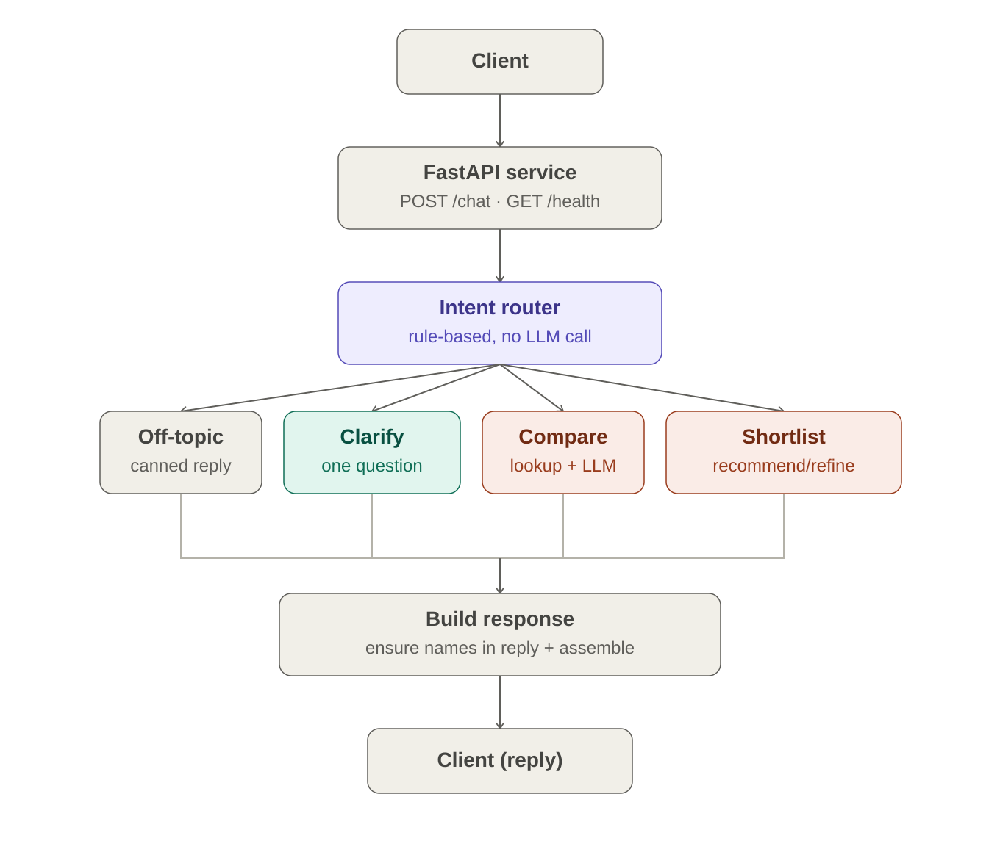
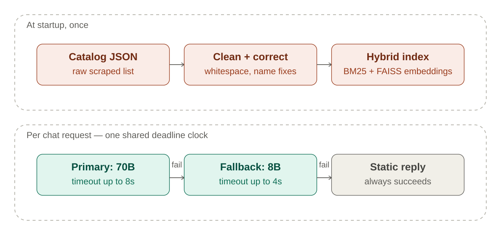

# SHL Assessment Recommender

A FastAPI service that recommends SHL assessments based on a natural-language hiring conversation. Uses hybrid BM25 + FAISS retrieval over the SHL product catalog, with an LLM (Groq Llama 3.3 70B, falling back to Llama 3.1 8B) for clarification, comparison, and explaining recommendations. Routing is rule-based — no LLM call is used just to decide what to do with a message.

## Live API

`POST https://<your-render-url>.onrender.com/chat`

## Architecture

**Request flow.** Every message goes through a rule-based router first (off-topic guard, comparison detector, refine/confirm detector, and a requirement-extraction check for "do we have enough context yet"). The router decides one of four paths, and every path funnels into the same response builder, which guarantees every item in `recommendations` is actually named in the reply text before it's sent back.



- **Off-topic** — a fixed canned reply, no LLM call. Impossible to talk the model out of a refusal since there's no model in that path at all.
- **Clarify** — one short, single-question LLM prompt, targeted at whatever specific detail is still missing.
- **Compare** — retriever looks up the named items, LLM explains only from that grounded context.
- **Shortlist (recommend/refine)** — the retriever always owns the final list; the LLM only explains or phrases the reply around it, so a hallucinated URL is impossible by construction, not just by prompting.

**Supporting systems.** The catalog is cleaned and indexed once at startup, not per request. Each LLM call inside a `/chat` request shares one countdown clock across the primary model, the fallback model, and a static safety-net reply, so retrieval time correctly shrinks the LLM's timeout instead of the two budgets stacking past the evaluator's 30-second cap.



## Tech Stack

- FastAPI + Pydantic
- Hybrid retrieval: BM25 (rank-bm25) + dense embeddings (sentence-transformers + FAISS), with a fuzzier exact-lookup for direct name matches
- Groq (llama-3.3-70b-versatile → llama-3.1-8b-instant → static reply), with deadline-based budgeting shared across the whole request
- Rule-based intent router (no LLM call for routing) with structured requirement extraction to decide when enough context exists to recommend
- Stateless refine handling that reconstructs the last shortlist from conversation history and applies adds/removes/full-replacement edits without dropping explicitly-requested items

## Running locally

```bash
python -m venv venv
source venv/bin/activate   # venv\Scripts\activate on Windows
pip install -r requirements.txt
cp .env.example .env        # add your GROQ_API_KEY
uvicorn app.main:app --reload
```

API will be live at `http://localhost:8000`. Health check: `GET /health`.

> **Security note:** `GROQ_API_KEY` is read only from the environment (a local, git-ignored `.env`). There is no hardcoded fallback key anywhere in the codebase.

## Environment Variables

| Variable | Required | Description |
|---|---|---|
| `GROQ_API_KEY` | Yes | Groq API key |
| `GROQ_MODEL` | No | Default: `llama-3.3-70b-versatile` |
| `GROQ_FALLBACK_MODEL` | No | Default: `llama-3.1-8b-instant` |

## API Contract

**POST /chat**
```json
{
  "messages": [
    { "role": "user", "content": "I need a Java developer assessment" }
  ]
}
```

Response:
```json
{
  "reply": "Here are the assessments that best match...",
  "recommendations": [
    { "name": "...", "url": "...", "test_type": "K" }
  ],
  "end_of_conversation": false
}
```

## Evaluation

`tests/replay_eval.py` replays the sample conversations against a running instance of the API and reports Mean Recall@10 against each conversation's final expected shortlist.

```bash
uvicorn app.main:app --reload
python tests/replay_eval.py
```